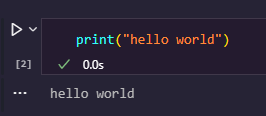

# Reinforcement learning in robotics

## Table of Contents
1. [Introduction](#introduction)
2. [Project structure](#project-structure)
3. [Setting Up a Virtual Environment](#setting-up-a-virtual-environment)
4. [Installing Dependencies](#installing-dependencies)
5. [Running the Project](#running-the-project)
6. [Contact data](#contact-data)
7. [License](#license)

## Introduction

Reinforcement learning is a type of machine learning where an agent learns to make decisions by interacting with an environment. The agent observes the rewards or penalties resulting from its actions and adjusts its behavior to maximize the total reward over time. This learning process is based on the feedback the agent receives from the environment.

This project applies reinforcement learning to the field of **mobile robotics**. The specific task is for a robot to plan a route in an environment that contains obstacles. The robot's goal is to reach its destination while minimizing the chance of colliding with any obstacles.

The project uses **Markov Decision Processes** (MDPs) as the underlying mathematical model for the interactions between the robot (the decision-making agent) and the environment. In an MDP, the agent makes decisions at each time step to maximize a performance measure, which in this case is the accumulated reward over time. The environment is stochastic, meaning there is some level of uncertainty or randomness involved in the outcomes of the robot's actions.

Several reinforcement learning algorithms, including **Q-Learning**, **SARSA**, and **Monte Carlo** algorithms, will be used and compared in this project. These algorithms use MDPs to model the environment and calculate optimal strategies for the robot. They learn iteratively from the robot's experiences, adjusting their action policies to maximize the expected reward. They balance learning and decision-making using techniques like exploration (trying out new actions to see their effects) and exploitation (using the current knowledge to make the best decision).

## Project structure

- `resources`: Other files used in the project
- `src/`: This directory contains the source code of the project.
  - `main.ipynb`: Main script of the project.
  - `Project statement.pdf`: A longer statement of the project.
- `.gitignore`: Folders not to include in the repository
- `README.md`: A briefing of the project and how to run it.
- `requirements.txt`: List of Python dependencies of the project.

## Setting Up a Virtual Environment

To create a virtual environment, navigate to the project directory and run the following command:

```bash
python3 -m venv venv
```

This will create a new virtual environment in a folder named `venv`.

To activate the virtual environment, use the following command:

On Windows:

```bash
venv\Scripts\activate
```

On Unix or MacOS:

```bash
source venv/bin/activate
```

## Installing Dependencies
Once the virtual environment is activated, you can install the project's dependencies using the `requirements.txt` file. Run the following command:

```bash
pip install -r requirements.txt
```

This will install all the necessary packages for this project.

## Running the Project
To run each cell of the notebook, click the "play" button next to the cell:



Or simply click

```bash
shift enter
```

## Contact data

If you have any request or inquiry, feel free to contact me at [pabcabmar3@alum.us.es](mailto:pabcabmar3@alum.us.es)
